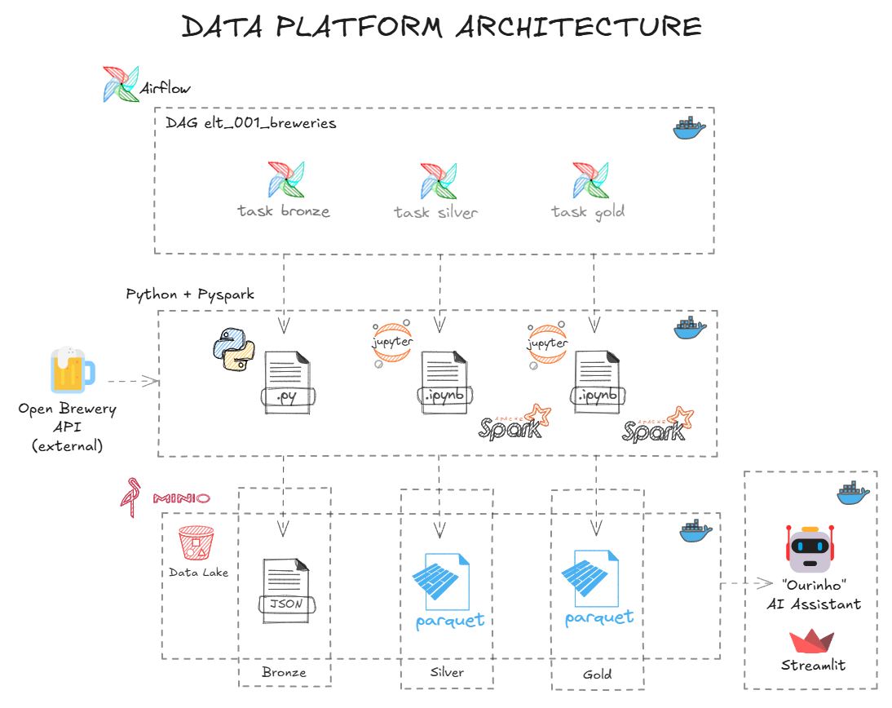
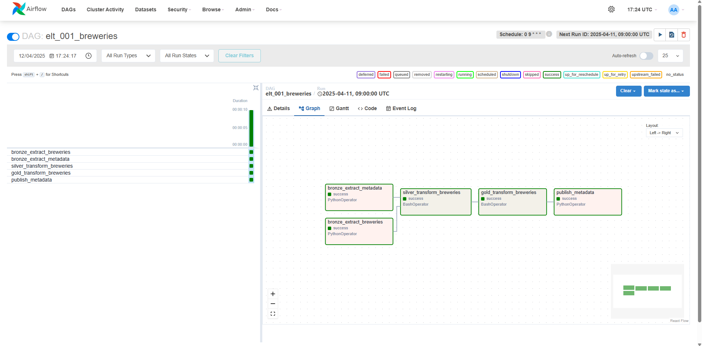
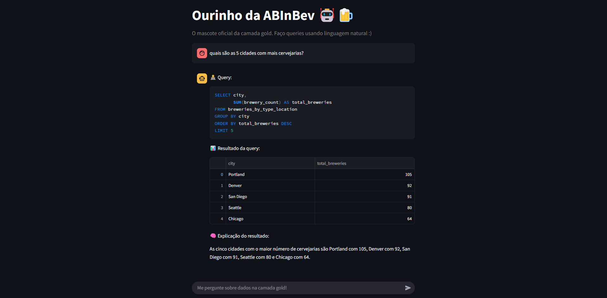

# BEES & ABInBev Data Engineering Challenge


<div align="center">

  
  
  
  
  
  
  

</div>

## Project Description

This project was developed as part of the BEES & ABInBev Data Engineering technical challenge. Its main goal is to demonstrate the ability to build a modern, robust, and modular data pipeline using the medallion architecture (bronze, silver, and gold), from ingestion to interactive data visualization.

### Context

Using the public API [Open Brewery DB](https://www.openbrewerydb.org/), which contains data on American breweries, the data is extracted, stored in a data lake, transformed, and later aggregated following data engineering best practices.

### Key Features

- **Data Extraction**
  - Automated collection using Python `requests`
  - Pipeline orchestration and monitoring with Airflow
  - Retries and/or email notifications in case of failure

- **Storage in Data Lake (MinIO)**
  - Bronze Layer: raw data
  - Silver Layer: cleaned and partitioned Parquet data by location
  - Gold Layer: data aggregated by type and state

- **Transformations with PySpark in Jupyter Notebooks**
  - Cleaning, partitioning, and aggregation
  - Organized in notebooks for each layer

- **Data Visualization with Streamlit and ChatGPT**
  - AI assistant via chat interface with Streamlit
  - Integration with the OpenAI API

- **Containerization with Docker**
  - Services organized using Docker Compose
  - Easy local reproducibility

## Prerequisites

Before running the project, make sure you have:

- **Docker** installed (and Docker Compose)

- **Minimum hardware requirements**:
  - CPU: 4 cores
  - RAM: 12 GB (ideally 16 GB)

## How to run the project?

```bash
docker network create project-net
docker compose -f minio/docker-compose.minio.yaml --env-file minio/.env up --build -d
docker compose -f airflow/docker-compose.airflow.yaml up --build -d
docker compose -f spark/docker-compose.spark.yaml up --build -d
docker compose -f streamlit/docker-compose.streamlit.yaml up --build -d
```

## Folder Structure
```
.
├── airflow/
│   ├── dags/
│   │   ├── classes/
│   │   ├── tasks/
│   │   └── elt_001_breweries.py
│   ├── Dockerfile
│   ├── requirements.txt
│   └── docker-compose.airflow.yaml
│
├── minio/
│   ├── .env
│   └── docker-compose.minio.yaml
│
├── spark/
│   ├── notebooks/
│   │   ├── 1-bronze/
│   │   ├── 2-silver/
│   │   └── 3-gold/
│   ├── Dockerfile
│   ├── start-spark.sh
│   └── docker-compose.spark.yaml
│
├── streamlit/
│   ├── gold-metadata/
│   ├── main.py
│   ├── requirements.txt
│   ├── Dockerfile
│   └── docker-compose.streamlit.yaml
└── images/

```
## Live Preview
### Airflow

### Streamlit AI Assistant


## Contact

Made with ☕ by [**João Pedro Campos Faria**](https://www.linkedin.com/in/ocamposfaria)  
<p align="left">
  
</p>
